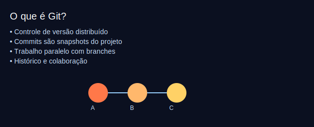

# Aula 01 — O que é Git? Por que usar? Primeiros passos (30min)



## Objetivos
- Entender o que é controle de versão e por que Git é útil.
- Instalar e configurar o Git (nome e e-mail).
- Criar um repositório local e fazer o primeiro commit.

## Plano (30min)
- 0–3m: Contexto do problema (trabalhar sem perder versões?).
- 3–10m: Conceitos: snapshot, commit, histórico, repositório.
- 10–20m: Demonstração: `git init`, `git status`, `git add`, `git commit`.
- 20–27m: Prática guiada.
- 27–30m: Checagem rápida e dúvidas.

## Pré-requisitos
- Git instalado. Conta no GitHub (será usada na Aula 05).

## Conteúdo e comandos
```bash
git --version
git config --global user.name "Seu Nome"
git config --global user.email "seuemail@example.com"
mkdir meu-projeto && cd meu-projeto
git init
echo "# Meu Projeto" > README.md
git status
git add README.md
git commit -m "chore: primeiro commit"
git log --oneline
```

## Atividade guiada
1. Inicie um repositório local.
2. Crie e faça commit do README.md.
3. Rode `git log --oneline` e explique o resultado para um colega.

## Desafio extra
- Edite o README.md com uma segunda linha e faça um novo commit.

## Avaliação rápida (1 pergunta)
- O que o `git add` faz no ciclo de trabalho?

## Recursos
- Imagem introdutória: `assets/git-what-is.svg`