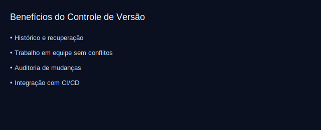

# Aula 01 — Introdução ao Git

Objetivos
- Entender o que é controle de versão e o problema que o Git resolve.
- Compreender snapshots (commits), repositório local e remoto.
- Preparar ambiente de prática (pasta de projeto e `git init`).

Teoria rápida
- Controle de versão: guarda o histórico de alterações, permite voltar no tempo, trabalhar em equipe sem sobrescrever mudanças.
- Git é distribuído: cada pessoa tem um repositório completo localmente.
- Commit = “foto” do projeto num momento do tempo, com autor, data e mensagem.

Imagens
- 

Prática guiada
```bash
# 1) Crie e entre numa pasta de projeto
mkdir meu-projeto && cd meu-projeto

# 2) Inicie um repositório Git (criando a pasta .git)
git init

# 3) Crie um arquivo e veja o status
echo "# Meu Projeto" > README.md
git status

# 4) Faça o primeiro commit (vamos detalhar add/commit na Aula 03)
git add README.md
git commit -m "chore: primeiro commit com README"
git log --oneline
```

Exercícios
1) Crie mais um arquivo `TAREFAS.md` com 3 itens de tarefas iniciais. Verifique `git status` e explique o que aparece.
2) Faça `git add TAREFAS.md` e depois `git commit -m "docs: adiciona lista de tarefas"`.

Desafio
- Edite o README, adicione uma breve descrição e faça novo commit. Explore `git log --oneline --decorate`.

Checklist de saída
- Você sabe o que é um commit e como iniciar um repositório com `git init`.

Erros comuns
- Criar o projeto dentro de outro `.git` por engano. Use `pwd` (ou `cd`) para confirmar onde está e `ls -a` para ver se existe `.git`.

Recursos visuais extras
- 