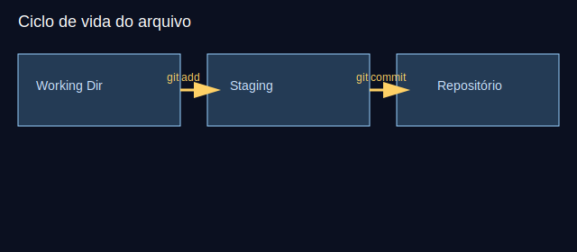

# Aula 02 — Ciclo de vida: working, staging, commit (30min)



## Objetivos
- Visualizar working directory, staging area e repositório.
- Praticar `status`, `add`, `commit`, `diff`, `.gitignore`.

## Plano (30min)
- 0–5m: Revisão Aula 01.
- 5–12m: Teoria: estados dos arquivos, `.gitignore`.
- 12–20m: Demonstração: editar, `diff`, `add`, `commit`.
- 20–27m: Prática guiada.
- 27–30m: Checagem rápida.

## Comandos
```bash
git status
git diff
git add .
git commit -m "feat: adiciona página inicial"
git log --oneline --graph
echo "node_modules/" >> .gitignore
git status
```

## Atividade guiada
- Crie `index.html`, adicione conteúdo básico e faça commit.
- Crie `.gitignore` e adicione uma pasta fictícia `build/`, verifique `status`.

## Desafio extra
- Faça uma alteração pequena e compare com `git diff`.

## Avaliação rápida
- Qual a diferença entre working directory e staging area?

## Recursos
- Imagem: `assets/working-staging-repo.svg`