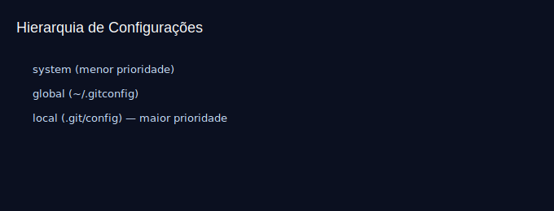

# Aula 02 — Instalação e Configuração

Objetivos
- Instalar o Git e verificar versão.
- Configurar nome, e-mail, editor e opções úteis.
- Entender prioridade de configurações (system, global, local).

Imagens
- 
- 

Teoria rápida
- Configurações podem ser definidas em 3 níveis:
  - system: para todos os usuários (menos comum)
  - global: para seu usuário (mais comum)
  - local: para um repositório específico (sobrepõe as anteriores)
- Nome e e-mail viram parte do metadado de cada commit.

Prática guiada
```bash
git --version
git config --global user.name "Seu Nome"
git config --global user.email "seuemail@example.com"
git config --global core.editor "code --wait"        # VS Code espera fechar
git config --global init.defaultBranch "main"        # define 'main' por padrão
git config --list --show-origin                      # ver onde está definida cada config

# Config local (dentro do repo)
cd meu-projeto
git config user.email "email-escolar@example.com"
git config --list --show-origin
```

Exercícios
1) Defina o editor padrão como `nano` (ou outro preferido) e confirme com `git config --global -e`.
2) Dentro do repositório, sobrescreva apenas o `user.name` localmente e confirme.

Dica
- Para ver arquivos de configuração:
  - Windows: `C:\Users\SEU_USUARIO\.gitconfig`
  - macOS/Linux: `~/.gitconfig`

Checklist de saída
- Você consegue explicar a diferença entre configs global e local.