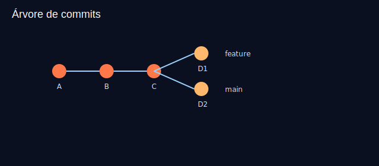

# Aula 05 — Histórico: log, show, diff

Objetivos
- Navegar no histórico com `git log` em diferentes formatos.
- Ver conteúdo de commits com `git show`.
- Comparar diferenças com `git diff`.

Imagens
- 
- 

Teoria rápida
- `git log` aceita muitos filtros (autor, caminho, quantidade).
- `git diff` sem argumentos compara working dir vs index; com referências, compara commits/branches.

Prática guiada
```bash
# formatos comuns de log
git log --oneline --decorate --graph --all
git log -p -- index.html             # histórico com patch de um arquivo
git log --since="2 days ago" --author="Seu Nome"

# inspecionar último commit
git show HEAD
git show HEAD -- index.html          # apenas um arquivo

# comparar diferenças
echo "<p>Novo parágrafo</p>" >> index.html
git diff                             # working vs index
git add index.html
git diff --staged                    # index vs HEAD
git commit -m "feat: adiciona parágrafo na home"

# comparar commits
git diff HEAD~1 HEAD
```

Exercícios
1) Mostre o histórico apenas de `app.js` com patch.
2) Compare seu penúltimo e último commit.

Checklist de saída
- Você consegue ler o histórico em diferentes granularidades.