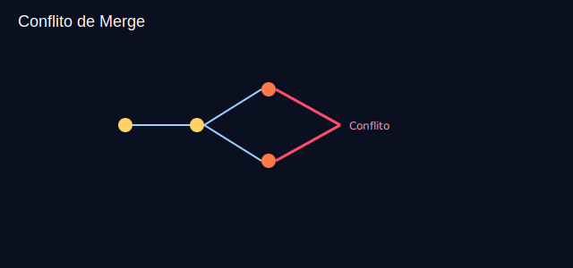

# Aula 07 — Resolvendo conflitos (30min)



## Objetivos
- Gerar e resolver um conflito de merge.
- Entender marcadores de conflito e boas práticas.

## Plano (30min)
- 0–5m: Por que conflitos acontecem?
- 5–15m: Demo: criar conflito, resolver, commit de merge.
- 15–25m: Prática guiada.
- 25–30m: Checagem.

## Passos (exemplo)
```bash
git checkout -b feature/titulo
# editar mesma linha em index.html, commit
git checkout main
git checkout -b hotfix/titulo
# editar a MESMA linha de index.html, commit
git checkout main
git merge feature/titulo
git merge hotfix/titulo  # conflito
# abrir arquivo, resolver, git add, git commit
```

## Recursos
- Imagem: `assets/conflict-merge.svg`