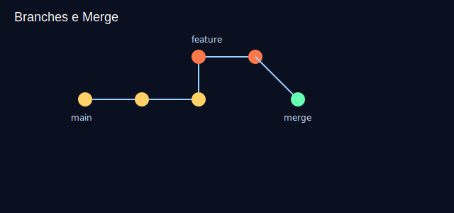
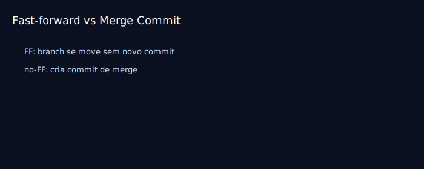

# Aula 08 — Merge básico

Objetivos
- Diferenciar fast-forward e merge commit.
- Realizar merges simples e visualizar o histórico.

Imagens
- 
- 

Teoria rápida
- Fast-forward: `main` “anda” até a ponta da feature (sem novo commit de merge).
- Merge commit: cria um commit especial juntando duas linhas de histórico.

Prática guiada
```bash
# partindo de main
git switch main
git merge feature/cabecalho
git log --oneline --graph --decorate

# forçar merge commit (sem FF)
git switch -c feature/rodape
echo "<footer>Rodapé</footer>" >> index.html
git add index.html && git commit -m "feat: adiciona rodapé"
git switch main
git merge --no-ff feature/rodape -m "merge: integra feature/rodape"
git log --oneline --graph --decorate
```

Exercícios
1) Crie uma branch curta, faça um commit e faça merge na `main`. Observe se foi FF ou merge commit.
2) Repita com `--no-ff` e compare os históricos.

Checklist de saída
- Você sabe realizar merge e ler o histórico resultante.