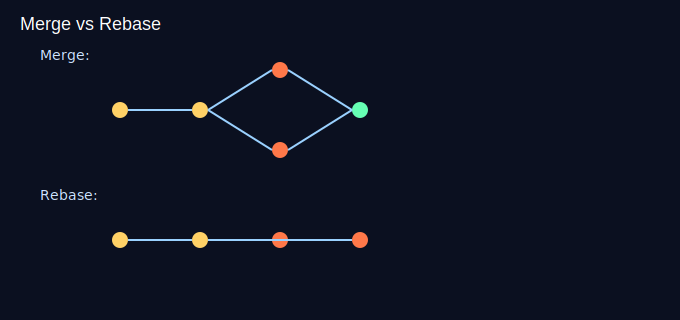

# Aula 08 — Reescrita de histórico segura (amend, rebase) (30min)



## Objetivos
- Ajustar o último commit com `--amend`.
- Usar rebase interativo para limpar a história antes do PR.
- Entender quando NÃO reescrever (após push compartilhado).

## Plano (30min)
- 0–5m: Motivação: história limpa ajuda revisão.
- 5–12m: Conceitos: rebase x merge, perigos após push.
- 12–20m: Demo: `commit --amend`, `rebase -i`.
- 20–27m: Prática guiada.
- 27–30m: Checagem.

## Comandos
```bash
git commit --amend -m "feat: título melhorado"
git rebase -i HEAD~3  # pick/squash/reword
git log --oneline
```

## Atividade guiada
- Faça 2–3 commits pequenos e “squash” em 1 usando rebase interativo (sem push prévio).

## Recursos
- Imagem: `assets/rebase-vs-merge.svg`