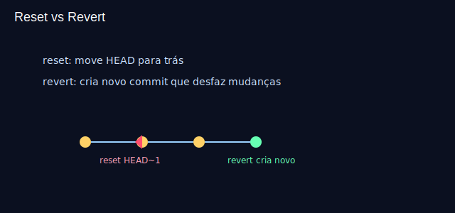

# Aula 09 — Recuperação e diagnóstico: reset, revert, reflog (30min)



## Objetivos
- Diferenciar `reset` (mexe no ponteiro) de `revert` (novo commit inverso).
- Usar `reflog` para encontrar commits “perdidos”.

## Plano (30min)
- 0–6m: Teoria: riscos e quando usar cada um.
- 6–15m: Demo: `reset --soft|--mixed|--hard`, `revert`, `reflog`.
- 15–25m: Prática guiada.
- 25–30m: Checagem.

## Comandos
```bash
git reset --soft HEAD~1
git reset --mixed HEAD~1
git reset --hard HEAD~1   # cuidado!
git revert <hash>
git reflog
```

## Atividade guiada
- Faça um commit ruim e reverta com `git revert`.
- Explore `git reflog` e anote um hash anterior.

## Recursos
- Imagem: `assets/reset-revert.svg`