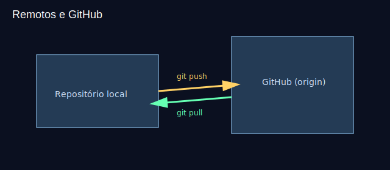

# Aula 09 — Remotos: origin, push, pull

Objetivos
- Configurar um remoto e fazer o primeiro push.
- Diferenciar HTTPS e SSH para autenticação.
- Trazer atualizações com `git pull` de forma segura.

Imagens
- 
- 

Teoria rápida
- Remoto `origin` por convenção aponta para seu repositório no GitHub.
- HTTPS + token pessoal (PAT) ou SSH com chave pública/privada.
- `git pull --ff-only` evita merges inesperados.

Prática guiada
```bash
# conectando um repositório local ao GitHub
git remote add origin https://github.com/<usuario>/<repo>.git
git branch -M main
git push -u origin main

# conferindo remotos
git remote -v

# recebendo atualizações
git pull --ff-only
```

Exercícios
1) Crie um repositório vazio no GitHub, conecte seu repo local e faça o primeiro push.
2) Altere o README no GitHub Web e faça `git pull --ff-only` localmente.

Checklist de saída
- Você sabe configurar `origin` e sincronizar `main`.