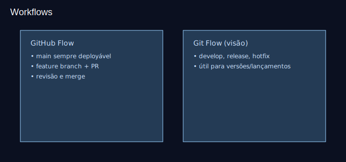

# Aula 10 — Boas práticas e fluxos de trabalho (30min)

## Objetivos
- Conhecer GitHub Flow e Git Flow (visão geral).
- Adotar convenções de branches e mensagens de commit.
- Encerrar com uma revisão geral.

## Plano (30min)
- 0–8m: Teoria: workflows e quando usar.
- 8–18m: Convenções: nomes de branch, Conventional Commits.
- 18–25m: Prática: criar uma pequena feature usando GitHub Flow.
- 25–30m: Revisão final e próximos passos.

## Convenções sugeridas
- Branches: `feature/`, `fix/`, `chore/`, `docs/`.
- Commits (Conventional Commits):
  - `feat: ...`, `fix: ...`, `docs: ...`, `chore: ...`, `refactor: ...`

## Recursos
- Imagem: `assets/git-workflows.svg`