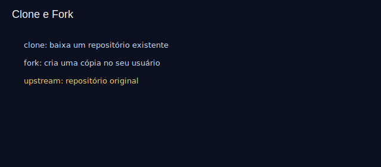

# Aula 10 — Clonar e fork básico

Objetivos
- Clonar repositórios via HTTPS/SSH.
- Entender a diferença entre clone e fork.
- Configurar `upstream` para sincronizar seu fork.

Imagens
- 
- 

Teoria rápida
- Clone: cópia local de um repositório existente.
- Fork: cópia do repositório no seu usuário no GitHub (permite PRs sem acesso de escrita).
- `upstream`: remoto apontando para o original, para sincronizar.

Prática guiada
```bash
# clone direto
git clone https://github.com/<usuario>/<repo>.git
cd repo
git remote -v

# em caso de fork
git remote add upstream https://github.com/<origem>/<repo>.git
git fetch upstream
git checkout main
git merge upstream/main
# ou rebase:
# git rebase upstream/main
```

Exercícios
1) Faça um fork de um repositório de exemplo, clone seu fork, adicione `upstream` e sincronize sua main.
2) Abra uma pequena PR no projeto original (opcional).

Checklist de saída
- Você diferencia clone vs fork e usa `upstream`.