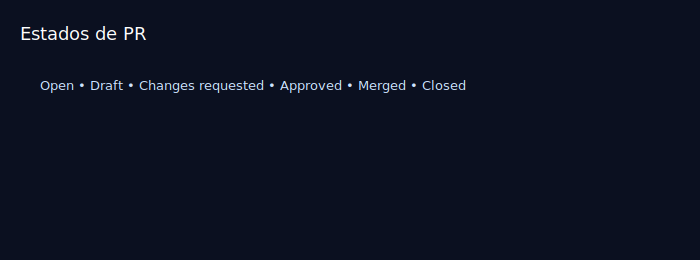

# Aula 11 — Pull Requests no GitHub

Objetivos
- Criar uma branch, fazer push e abrir uma Pull Request.
- Entender estados, revisões e estratégias de merge (merge, squash, rebase).

Imagens
- 
- 

Teoria rápida
- PR é uma proposta de mudança; permite revisão, discussões e checks.
- Estratégias:
  - Merge: preserva commits
  - Squash: condensa commits em um
  - Rebase: reescreve base antes de integrar

Prática guiada
```bash
git switch -c feature/rodape
echo "<footer>Contato: email@example.com</footer>" >> index.html
git add index.html
git commit -m "feat: seção de contato no rodapé"
git push -u origin feature/rodape

# Abra a PR no GitHub, preencha título/descrição,
# solicite revisão e escolha a estratégia de merge.
```

Exercícios
1) Em dupla, cada um faz uma PR no repo do outro com uma pequena melhoria.
2) Experimente fechar a PR com “Squash and merge” e observe o commit resultante na `main`.

Checklist de saída
- Você sabe abrir uma PR e escolher a estratégia de merge adequada.