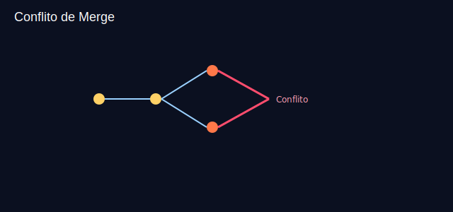

# Aula 12 — Conflitos e resolução

Objetivos
- Gerar e resolver conflitos de merge.
- Reconhecer marcadores de conflito e o fluxo de resolução.

Imagens
- 
- 

Teoria rápida
- Conflitos ocorrem quando a mesma linha de um arquivo foi alterada de formas diferentes em duas branches.
- Marcadores:
```
<<<<<<< HEAD
sua versão
=======
versão da outra branch
>>>>>>> feature/branch
```

Prática guiada
```bash
git switch -c feature/titulo
# altere a mesma linha do <h1> em index.html e commite
git add index.html && git commit -m "feat: titulo versão A"

git switch main
git switch -c hotfix/titulo
# altere a mesma linha de forma diferente e commite
git add index.html && git commit -m "fix: titulo versão B"

git switch main
git merge feature/titulo
git merge hotfix/titulo   # conflito esperado

# resolução:
# - abra index.html
# - edite para a versão desejada (ou combine)
git add index.html
git commit                 # finaliza o merge
```

Exercícios
1) Provoque um conflito em `styles.css` e resolva mantendo o melhor de cada lado.
2) Use `git log --merge` durante o conflito para ver commits envolvidos.

Checklist de saída
- Você consegue reconhecer e resolver conflitos no editor.