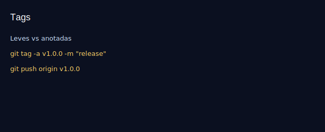

# Aula 16 — Tags e versões

Objetivos
- Criar tags leves e anotadas.
- Seguir SemVer e publicar tags no remoto.

Imagens
- 
- 

Teoria rápida
- Tag leve: apenas um nome apontando para um commit.
- Tag anotada: inclui metadados (autor, data, mensagem).
- SemVer: MAJOR.MINOR.PATCH (quebra compatibilidade/novos recursos/correções).

Prática guiada
```bash
git tag v0.1.0
git tag -a v1.0.0 -m "Primeiro release estável"
git tag
git show v1.0.0
git push origin v1.0.0
git push --tags
```

Exercícios
1) Crie `v0.2.0` como tag anotada, descrevendo as mudanças.
2) Publique apenas essa tag no remoto.

Checklist de saída
- Você usa tags para marcar versões e releases.