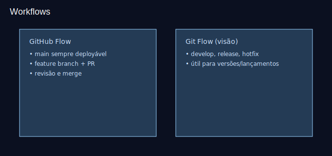

# Aula 17 — Workflows e Conventional Commits

Objetivos
- Comparar GitHub Flow vs Git Flow (visão geral).
- Nomear branches e escrever mensagens padrão (Conventional Commits).

Imagens
- 
- 

Teoria rápida
- GitHub Flow:
  - `main` sempre pronta para deploy
  - feature branches + PRs
- Git Flow (resumo):
  - `develop`, `feature/`, `release/`, `hotfix/`
- Conventional Commits:
  - `feat`, `fix`, `docs`, `style`, `refactor`, `test`, `chore`

Prática guiada
```bash
git switch -c feature/contato
# implemente algo simples e commite:
git commit -m "feat(contato): adiciona link para WhatsApp"
git push -u origin feature/contato
# abra uma PR com boa descrição e checklist de testes
```

Exercícios
1) Crie 3 commits usando `feat`, `fix` e `docs`.
2) Faça uma PR curta seguindo GitHub Flow.

Checklist de saída
- Você aplica um fluxo simples e escreve mensagens padronizadas.