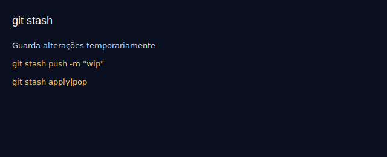

# Aula 18 — Stash: guardando trabalho

Objetivos
- Guardar alterações sem commitar.
- Listar, aplicar, descartar e inspecionar stashes.

Imagens
- 
- 

Teoria rápida
- `git stash push -m "descrição"` guarda alterações do working dir e stage.
- `apply` aplica mantendo o stash; `pop` aplica e remove.

Prática guiada
```bash
echo "<section>WIP</section>" >> index.html
git status
git stash push -m "wip: seção temporária"
git stash list
git stash show -p stash@{0}

# aplicar mantendo stash
git stash apply stash@{0}
# resolver conflitos se existirem, depois:
git stash drop stash@{0}
# ou em um passo:
# git stash pop
```

Exercícios
1) Faça alterações em dois arquivos, faça stash e aplique numa nova branch criada com `git switch -c`.
2) Inspecione o patch do stash antes de aplicar.

Checklist de saída
- Você usa stash para alternar contexto com segurança.