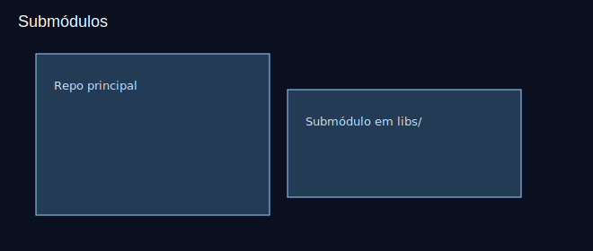

# Aula 19 — Submódulos (introdução)

Objetivos
- Adicionar e atualizar submódulos.
- Clonar repositórios com submódulos corretamente.

Imagens
- 
- 

Teoria rápida
- Submódulos são repositórios dentro de outro repositório.
- Úteis para dependências fixas que também são geridas por Git.

Prática guiada
```bash
# adicionando submódulo
git submodule add https://github.com/<org>/<lib>.git libs/lib-exemplo
git status
git commit -m "chore: adiciona submódulo lib-exemplo"

# inicialização e atualização
git submodule init
git submodule update

# clone com submódulos
git clone --recurse-submodules https://github.com/<usuario>/<repo>.git

# manter atualizado
git submodule update --remote --merge
```

Exercícios
1) Adicione um submódulo qualquer em `libs/` e faça commit.
2) Teste o clone com `--recurse-submodules` em outra pasta.

Checklist de saída
- Você sabe adicionar e clonar repositórios com submódulos.