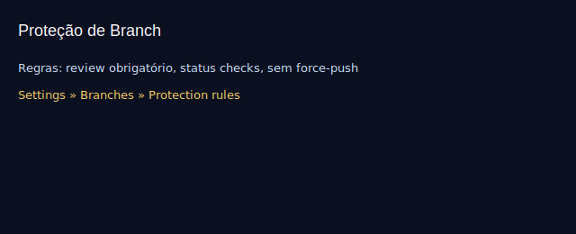

# Aula 20 — Boas práticas e proteções

Objetivos
- Configurar proteção de branch no GitHub.
- Adotar boas práticas de commits, PRs e revisão.

Imagens
- 
- 

Boas práticas
- Commits pequenos e frequentes, com mensagens claras.
- Branches nomeadas por escopo: `feature/`, `fix/`, `chore/`.
- PRs curtas com descrição, motivação e checklist de validação.
- Exigir revisão e checks (lint/test) antes do merge.

Proteção de branch (UI do GitHub)
- Settings > Branches > Add rule:
  - Protege `main`
  - Exigir revisões
  - Exigir status checks
  - Bloquear force-push e deletar branch protegida

Exemplo de checklist para PR
- [ ] Título no padrão Conventional Commits
- [ ] Descrição do problema e solução
- [ ] Screenshots (se UI)
- [ ] Testes e linters passando
- [ ] Sem mudanças desnecessárias

Exercícios
1) Ative proteção da `main` (se tiver permissão) e crie uma PR que requer revisão.
2) Revise a PR de um colega deixando comentários construtivos.

Checklist de saída
- Você sabe proteger a `main` e conduzir PRs saudáveis.